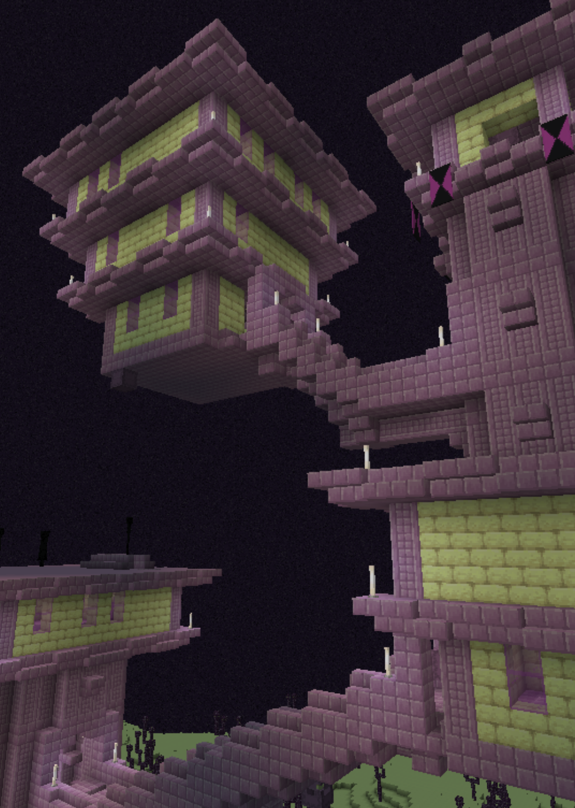

## Guided by principle
Everything that we're built around, every idea we adopt as a principle of the server, and down to who we select to be our staff members is cemented within our mission statement. Who we are as a server is where our values and trust lie as an organization; a supportive and experienced group of aspiring designers; developers, and engineers.

### Who we are
A group of aspiring designers; developers, and engineers. A collective who believes that sometimes everyone needs a place to kick back, block by block, bit by bit. An organization who is dedicated to transparency and excellence.

### What we're doing
Building an in-game community that's more resourceful, efficient, supportive, and always has the member at heart. We're putting architects, developers, and designers together for everyone's creative side.

### Our values
Placeholder.

	

		
      <i aria-hidden="true" class="fas fa-lock fa-4x"></i>
    
	

	

		<h3>Spotlight on security</h3>
		
We have a public-invite server on Discord where our members of our in-game server can freely discuss about anything that happens on (and off) the server.

        

	

		
      <i aria-hidden="true" class="fas fa-glass-whiskey fa-4x"></i>
    
	

	

		<h3>Half full philosophy</h3>
		
We have a public-invite server on Discord where our members of our in-game server can freely discuss about anything that happens on (and off) the server.

        

	

		
      <i aria-hidden="true" class="fas fa-fish fa-4x"></i>
    
	

	

		<h3>Bigger fish in the sea</h3>
		
We have a public-invite server on Discord where our members of our in-game server can freely discuss about anything that happens on (and off) the server.

        

	

		
      <i aria-hidden="true" class="fas fa-life-ring fa-4x"></i>
    
	

	

		<h3>Don't leave anyone hanging</h3>
		
We have a public-invite server on Discord where our members of our in-game server can freely discuss about anything that happens on (and off) the server.

        

### Who we're designing for
Placeholder.

 

    

      
        <i aria-hidden="true" class="fas fa-user fa-4x"></i>
      
    

    

      
        <i aria-hidden="true" class="fas fa-hippo fa-4x"></i>
      
    

    

      
        <i aria-hidden="true" class="fas fa-kiwi-bird fa-4x"></i>
      
    

    

      
        <i aria-hidden="true" class="fas fa-frog fa-4x"></i>
      
    

  

### How we started

        

            
Placeholder text.

        

        

               
        

